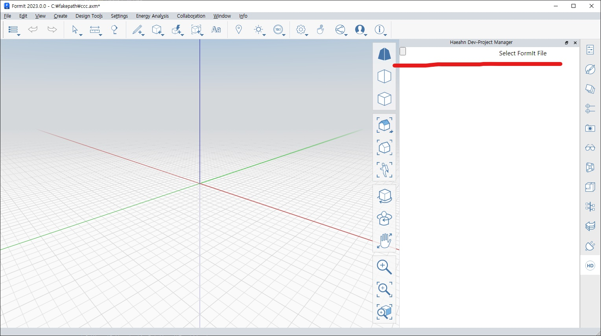
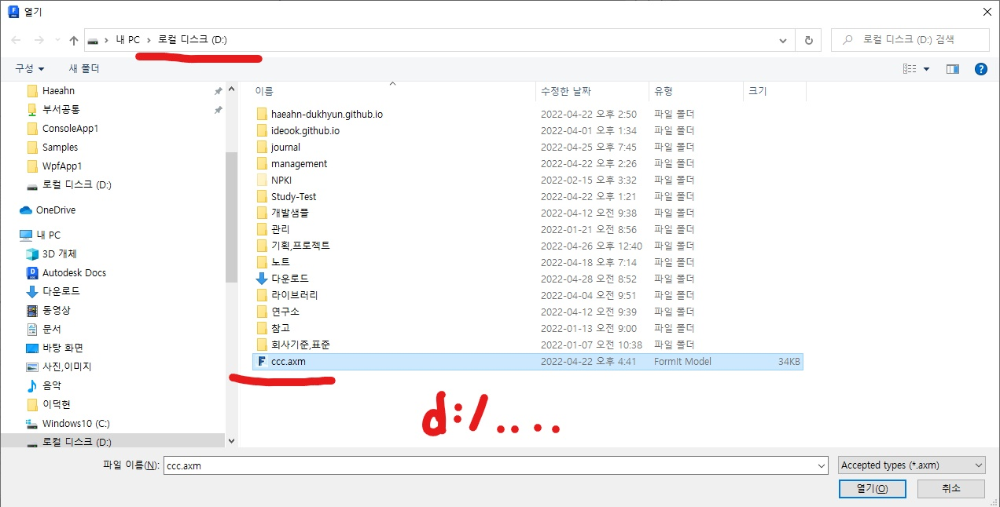
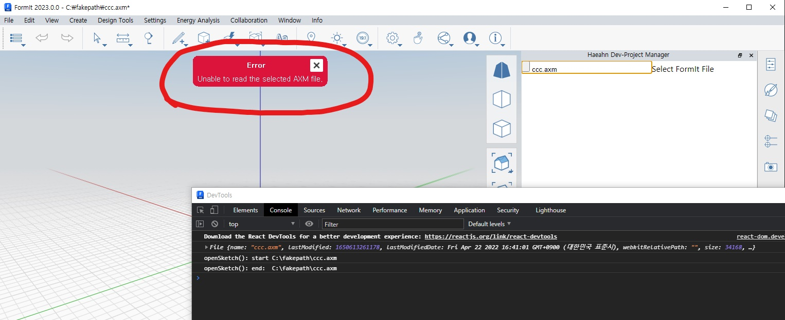
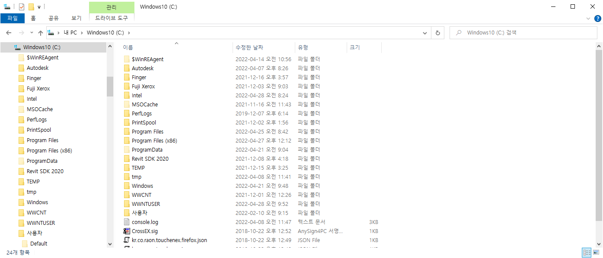

* function for select file using javascript 'input'

* select file from 'd:\ccc.axm'

* can't read selected file  
I selected the d:\ccc.axm file, but javascript does not send the real path for security reasons, but sends the file binary through 'fake path'.

* I don't have 'c:\fakepath\ccc.axm'

